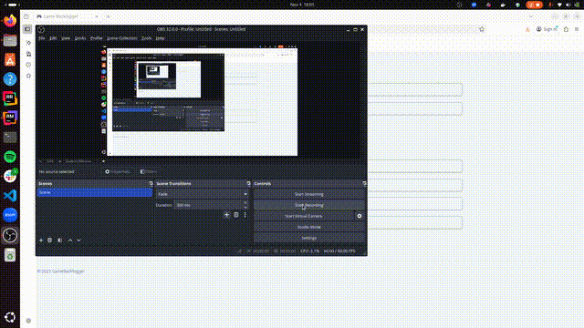

# Game Backlogger

A full-stack Ruby on Rails social networking web app for tracking your video game backlog. Add games from IGDB, categorize them on your backlog (Not started, In progress, Dropped, Completed), review them, and connect with friends to see what they’re playing.

## Demo



## Features
- Search games via the IGDB API (powered by Twitch)
- Add games to your personal backlog
- Categorize by status (Not started / In progress / Dropped / Completed)
- Send and accept friend requests
- View friends' game lists
- Comment on friends profiles and reviews
- PostgreSQL database with ActiveRecord
- Fully containerized with Docker
- CI tests via GitHub Actions

## Tech Stack
**Frontend:** Tailwind CSS, Turbo, ERB  
**Backend:** Ruby on Rails 8, PostgreSQL  
**APIs:** IGDB (via Twitch OAuth)  
**DevOps:** Docker, GitHub Actions (CI)

## Setup

### IGDB API Setup Instructions
Follow these instructions to setup IGDB API: https://api-docs.igdb.com/#getting-started 

### Option 1, Local (Manual)
1. Clone the repo:
   ```bash
   git clone https://github.com/willboyle18/game_backlogger.git
   cd game_backlogger
   ```
2. Install dependencies
   ```bash
   bundle install
   ```
3. Setup the database
   ```bash
   bin/rails db:setup
   ```
4. Start the server
   ```bash
   bin/dev
   ```
App runs on http://localhost:3000 

### Option 2, Docker
1. Build and run
   ```bash
   docker compose build
   docker compose up
   ```
2. Visit: http://localhost:3000
3. Stop containers (When done)
   ```bash
   docker compose down
   ```

## Tests
Run locally:
```bash
bin/rails test
```

## License
This project is licensed under the [MIT License](LICENSE).
